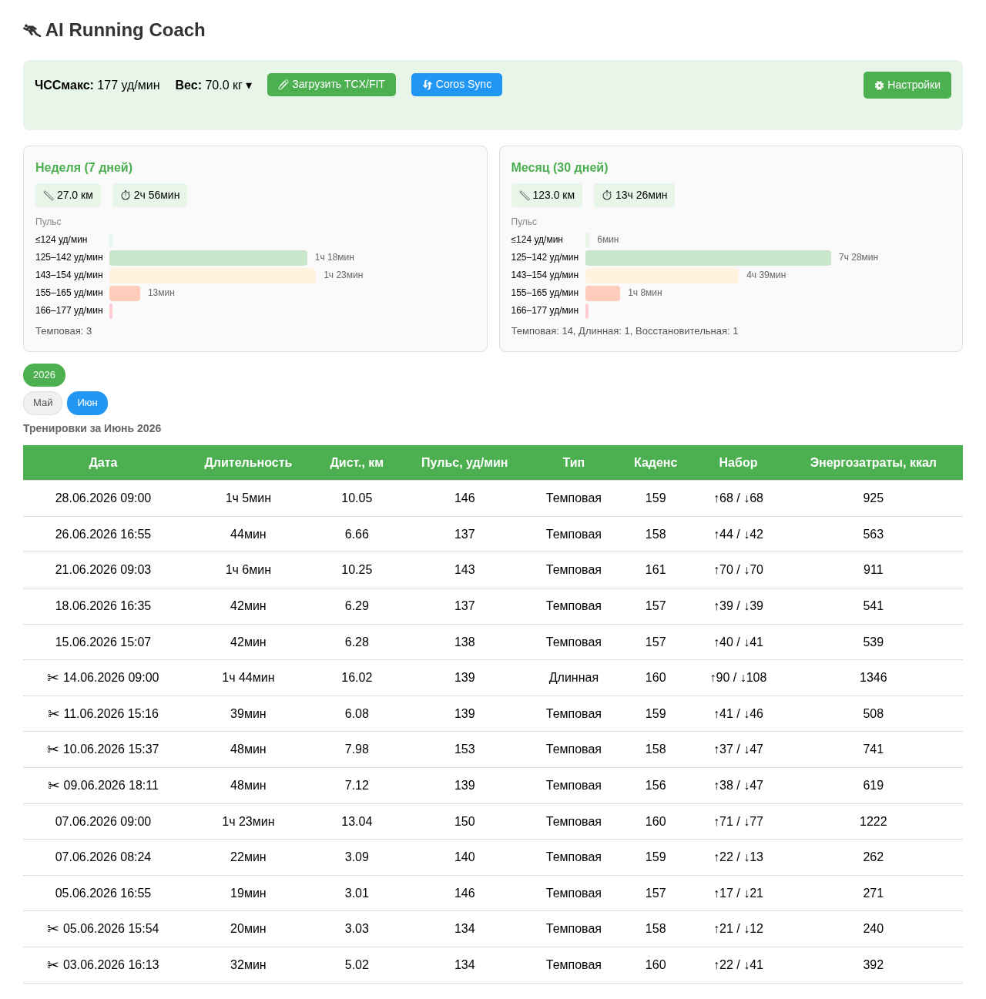
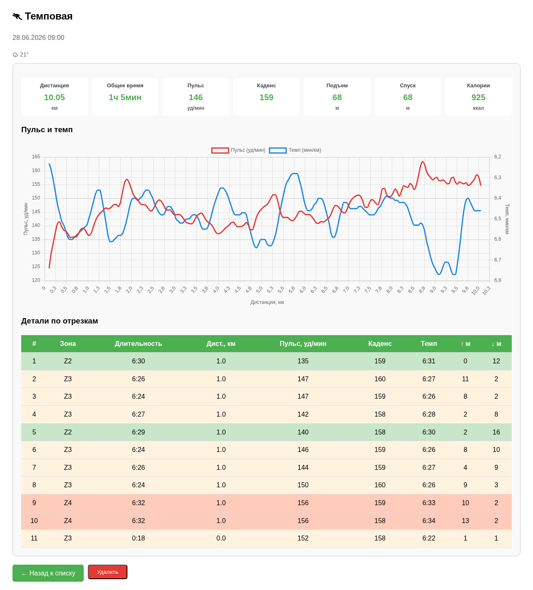
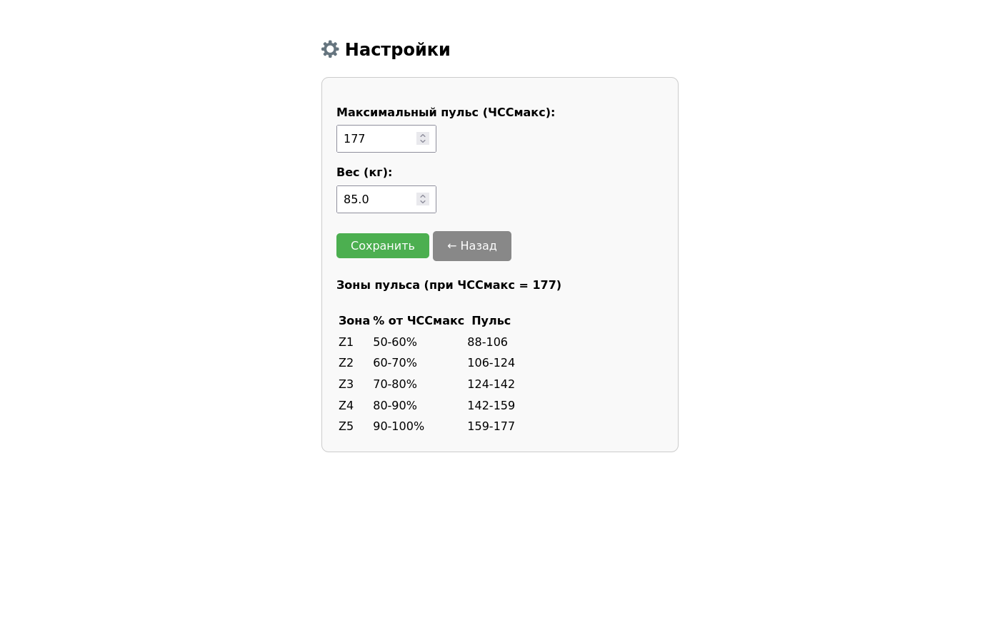

# 🏃 AI Running Coach

**Персональный ИИ-тренер по бегу (AI-powered personal running coach)**

Система анализирует тренировки из TCX-файлов (формат не привязан к конкретным часам — подойдут Garmin, Coros, Polar и любые другие), определяет тип бега (интервальная, темповая, восстановительная, длительная), отслеживает пульсовые зоны, набор высоты, погодные условия и динамику веса. В будущем — рекомендации тренировок на основе накопленной статистики.

---

## Концепция (Concept)

Накопить знания о тренировках спортсмена и с учётом статистики давать рекомендации на неделю, формировать план тренировок, хвалить за успехи и не давать перетренироваться — как настоящий тренер.

### Основные возможности (Features)

- **Загрузка TCX** — парсинг файлов любых часов (дистанция, пульс, высота, GPS; без привязки к бренду)
- **Классификация тренировок** — автоматическое определение типа: интервальная, темповая, длительная, восстановительная
- **Пульсовые зоны Z1–Z5** — расчёт времени в каждой зоне относительно ЧССмакс
- **Погода** — данные с Open-Meteo (температура, WMO иконка) по GPS-координатам
- **Высота** — набор и спуск по каждому сегменту и за тренировку
- **График пульса/темпа** — интерактивный Chart.js на странице тренировки
- **Статистика** — сводка за неделю и месяц (км, время, пульс, типы тренировок)
- **Вес** — отслеживание динамики с графиком и таблицей
- **Веб-интерфейс** — локальный сервер FastAPI с HTML/Chart.js

---

## Скриншоты (Screenshots)

| Главная страница (Main page) | Детальный просмотр (Session detail) |
|:---:|:---:|
|  |  |

| Настройки (Settings) |
|:---:|
|  |

---

## Стек технологий (Tech Stack)

- **Python 3** + **FastAPI** — сервер
- **SQLite** + **SQLAlchemy** — база данных
- **Chart.js** — графики на фронтенде
- **Open-Meteo API** — погода (бесплатно, без API-ключа)
- **timezonefinder** — определение часового пояса по GPS

---

## Быстрый старт (Quick Start)

```bash
# Установка зависимостей (Install dependencies)
cd running-coach
python3 -m venv .venv
source .venv/bin/activate
pip install -r requirements.txt

# Запуск сервера (Start server)
uvicorn main:app --host 0.0.0.0 --port 8000

# Открыть в браузере (Open in browser)
# http://localhost:8000
```

---

## Структура проекта (Project Structure)

```
running-coach/
├── project_plan.txt          # План проекта (Project roadmap)
├── README.md                 # Этот файл (This file)
├── screenshots/              # Скриншоты (Screenshots)
├── running-coach/
│   ├── main.py               # FastAPI роуты и HTML-шаблоны
│   ├── src/
│   │   ├── models.py         # SQLAlchemy модели
│   │   └── parsers/
│   │       └── tcx_parser.py # Парсинг TCX и классификация
│   ├── uploads/              # Загруженные файлы
│   └── running_coach.db      # SQLite БД (локально)
└── .gitignore
```

---

## Планы (Roadmap)

1. ✅ Окружение и конфигурация
2. ✅ Модели базы данных
3. ✅ Импорт данных (TCX)
4. ✅ Обработка и валидация данных
5. ✅ Классификация типа тренировки
6. ✅ Агрегация статистики
7. ⬜ Планирование и рекомендации по восстановлению (AI-рекомендации)
8. ⬜ Telegram бот
9. ⬜ Веб-интерфейс (доработка)
10. ⬜ Фоновые задачи
11. ⬜ Управление пользователями
12. ⬜ Мониторинг и обслуживание
13. ⬜ **Синхронизация Strava** — выгрузка данных о тренировках через Strava API
14. ⬜ **Данные о сне и восстановлении (Coros)** — получение данных со смарт-часов Coros (сон, HRV, уровень восстановления) через API или экспорт
